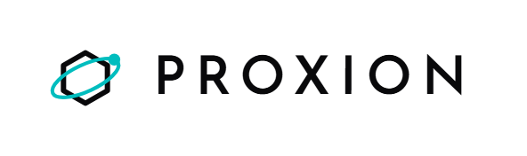
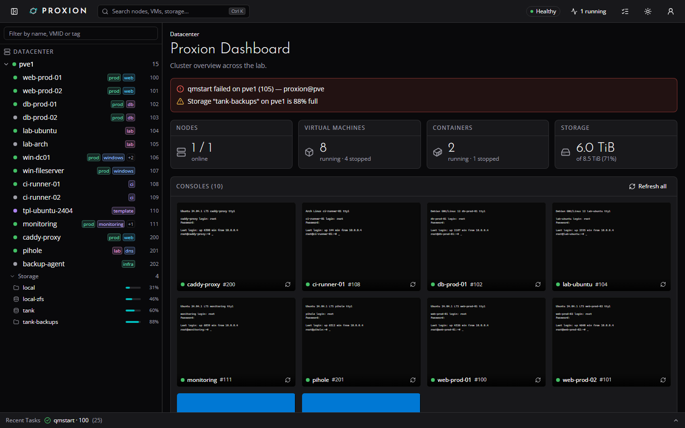
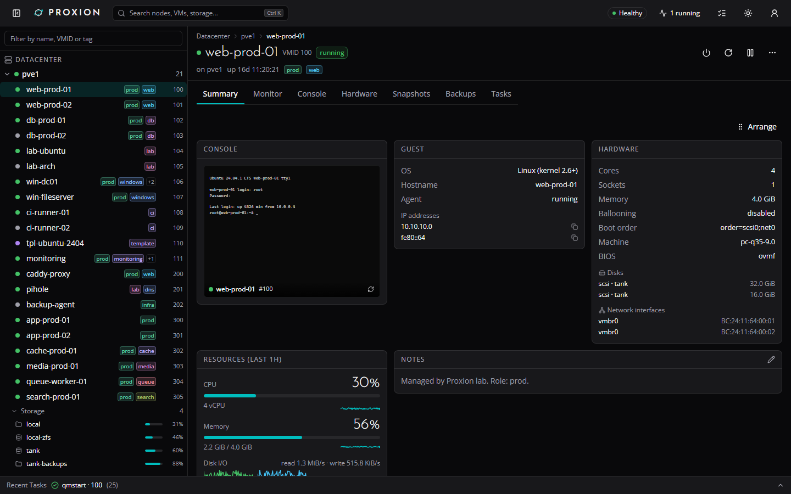
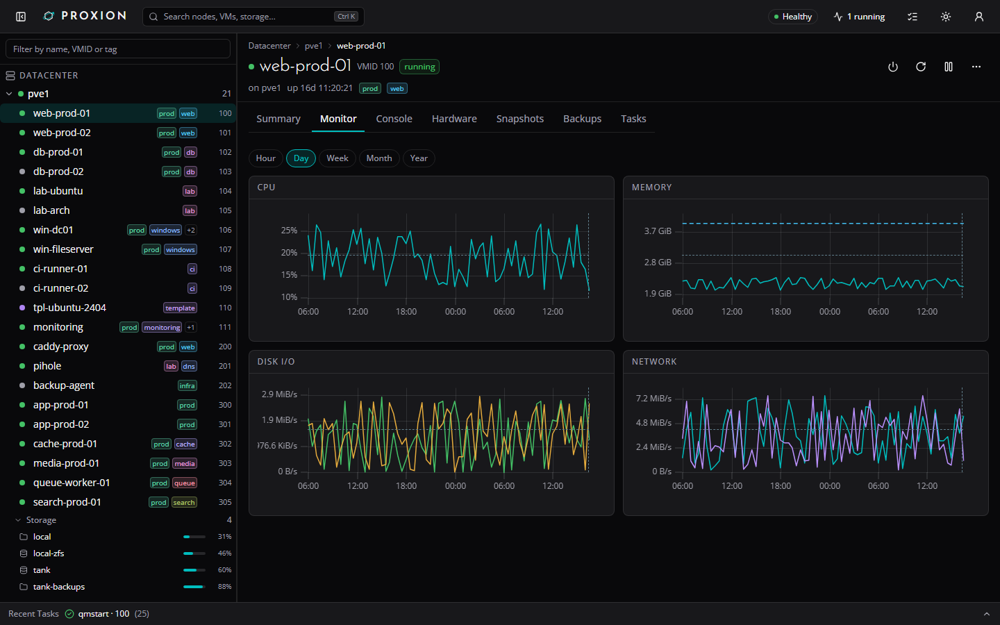
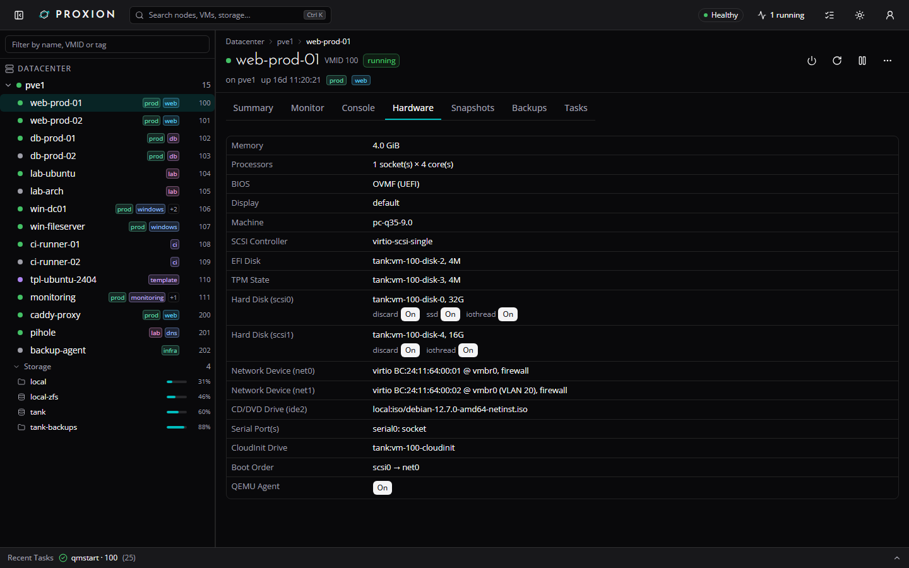
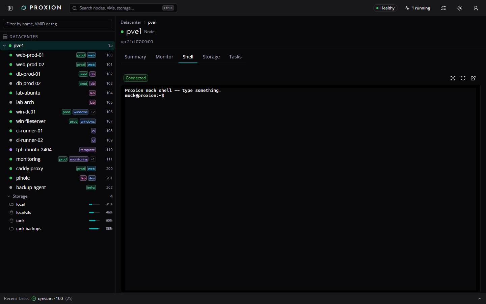
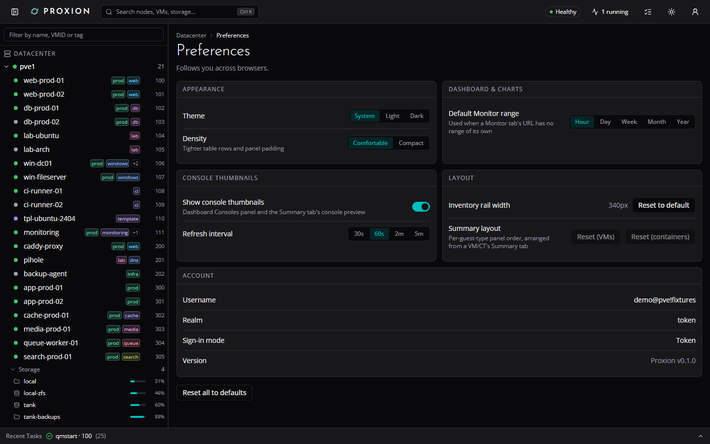
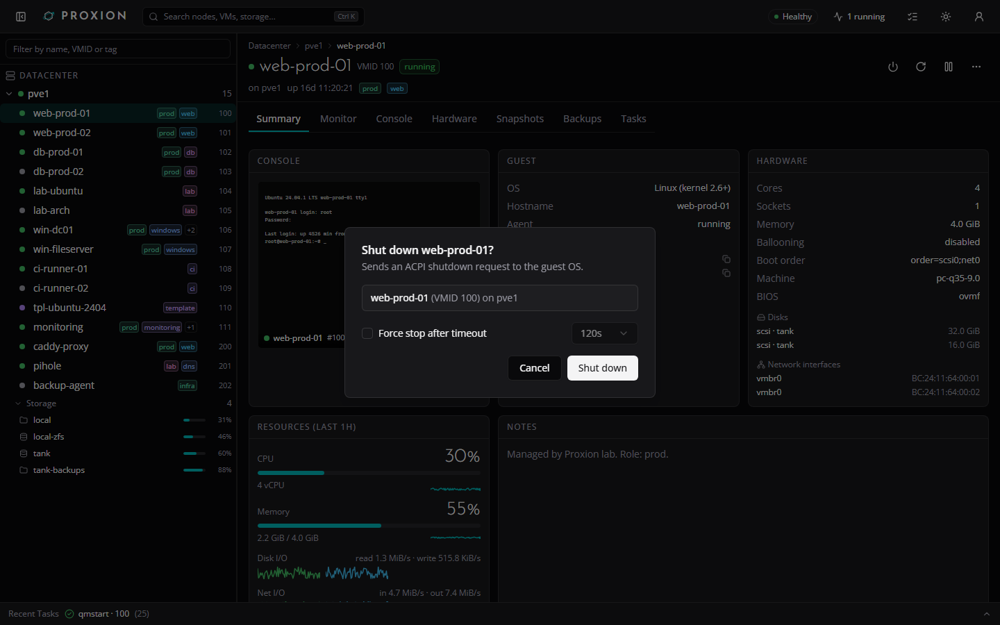
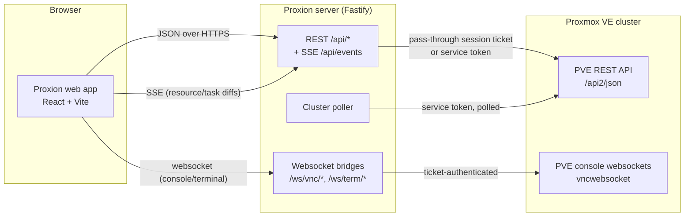

<p align="center">
  <picture>
    <source media="(prefers-color-scheme: dark)" srcset="docs/brand/lockup-dark.png">
    
  </picture>
</p>

<p align="center"></p>

# Proxion

**Try it in your browser:** https://c2tech-sys.github.io/proxion/ (sample data, no install)

Proxion is a modern, open-source web console for Proxmox VE that overlays
the stock UI: daily-driver views for the things you look at all day,
vSphere-style object pages for VMs/CTs/nodes, an embedded console and
terminal, and deep links back to the stock UI for everything else.

It's a pnpm monorepo: a Vite/React frontend, a Fastify API/proxy server,
and a generated Proxmox VE API client. The read-only PVE proxy
(`/api/pve/*`) is permanently write-blocked; the writes Proxion does
perform -- guest power actions, rename/notes, snapshots, console thumbnails
and per-user preferences -- each go through their own allow-listed route,
checked against your real PVE privileges -- see
[Feature status](#feature-status) below.

## Screenshots

| Dashboard                                                 | VM summary                                               |
| --------------------------------------------------------- | -------------------------------------------------------- |
|  |  |

| VM monitor charts                                       | VM hardware                                               |
| ------------------------------------------------------- | --------------------------------------------------------- |
|  |  |



| Preferences                                                 | Guest action confirmation                                        |
| ------------------------------------------------------------ | ------------------------------------------------------------------ |
|  |  |

## Quickstart

Get from nothing to a running Proxion in one `docker compose up`.

### 1. Create a read-only PVE user + API token

Run on a Proxmox node as root (or an equivalently privileged user) -- this
gives Proxion's live dashboard/task feed just enough to read your cluster,
plus console access for the embedded VNC/terminal bridges:

```bash
pveum role add ProxionReadOnly -privs "Datastore.Audit,Mapping.Audit,Pool.Audit,SDN.Audit,Sys.Audit,VM.Audit,VM.Console"
pveum user add proxion@pve
pveum aclmod / -user proxion@pve -role ProxionReadOnly
pveum user token add proxion@pve dev --privsep 0
```

The last command prints the token's secret once -- copy it somewhere safe;
you'll paste it into `.env` as `PVE_TOKEN_SECRET` below (`PVE_TOKEN_ID` is
`proxion@pve!dev`). You still sign in to the app itself with your own PVE
username/password (Proxion never stores it) -- this token is only for the
always-on cluster poller.

### 2. Get your PVE cert's TLS fingerprint

PVE's default certificate is self-signed, so Proxion pins to it instead of
either trusting a real CA or disabling verification:

```bash
pvenode cert info
# or: openssl s_client -connect pve.example.local:8006 </dev/null 2>/dev/null \
#       | openssl x509 -fingerprint -sha256 -noout
```

Copy the `Fingerprint (sha256)` value into `PVE_TLS_FINGERPRINT` below.

### 3. Configure and start

```bash
cp .env.example .env
# edit .env: PVE_URL, PVE_TLS_FINGERPRINT, PVE_TOKEN_ID, PVE_TOKEN_SECRET, SESSION_SECRET, ...
cp docker-compose.example.yml docker-compose.yml
docker compose up -d
```

`docker-compose.example.yml` pulls the published image
(`ghcr.io/c2tech-sys/proxion:0.1.0`) by default; uncomment the `build: .`
line instead if you'd rather build it locally from this checkout.

Open **http://<host>:3080** and sign in with your own PVE username and
password.

### Try it without a Proxmox host

No cluster handy? Run the UI against static fixtures instead -- no server,
no PVE, no Docker:

```bash
pnpm install && pnpm demo
```

### Production notes

- Put Proxion behind TLS -- see [docs/deploy.md](docs/deploy.md) for
  reverse-proxy config (nginx/Caddy) and the
  [Caddy + Azure DNS kit](deploy/caddy-azure-dns/README.md) for a
  mesh-only deployment with a real Let's Encrypt certificate.
- Set a real `SESSION_SECRET` (`openssl rand -hex 32`) -- required in
  production.
- Review `PROXION_COOKIE_SECURE` if Proxion itself is served over plain
  HTTP behind something else that terminates TLS.
- The optional per-node [host agent](agent/README.md) avoids a `vncproxy`
  task-log entry for every console thumbnail capture.

## Feature status

Reads go through a permanently read-only proxy. The writes this app
performs -- guest power actions, rename/notes, snapshot
create/delete/rollback, and migrate (below) -- each go through their own
allow-listed route, gated on a signed-in session and the matching PVE
privilege on that guest. Nothing else here can edit config or otherwise
change your cluster -- `/api/pve/*` itself stays a read-only proxy.

| Area                                               | Status          | Notes                                                                                                                                                                  |
| -------------------------------------------------- | --------------- | ---------------------------------------------------------------------------------------------------------------------------------------------------------------------- |
| Auth                                               | Works           | Pass-through PVE login (username/password/realm), signed httpOnly session cookie, transparent ticket renewal.                                                          |
| Dashboard                                          | Works           | Cluster-wide totals, cluster nodes table, top CPU/memory consumers, per-storage usage, and an alerts strip (failed tasks, storage over 85% full) from the live poller. |
| Inventory tree                                     | Works           | Datacenter -> node -> VM/CT, type-to-filter, status dots, tag chips, right-click context menu (open, console, shell, copy VMID/IP).                                    |
| Guest list                                         | Works           | vSphere-style "VMs and Templates" view at `/guests`: every guest across the cluster in one sortable, filterable table (search, status/type/node filters, per-user column visibility), sharing the inventory tree's own right-click actions. |
| Command palette (Cmd/Ctrl-K)                       | Works           | Search nodes/VMs/CTs by name, VMID, IP, tag.                                                                                                                           |
| VM/CT Summary tab                                  | Works           | Guest info, hardware, resource gauges, notes, related objects, last backup.                                                                                            |
| VM/CT Monitor tab / node Monitor tab               | Works           | Resource graphs from PVE's RRD data, hour through year (plus decade for nodes), with time-range chips and a unified hover tooltip.                                     |
| VM/CT Hardware tab                                 | Works           | Full device breakdown: disks, EFI disk, TPM state, NICs (VLAN/rate), CD-ROM, cloud-init, boot order, serial/USB/PCI passthrough.                                       |
| VM/CT Snapshots tab                                | Works (create/delete/rollback, session sign-in only) | Snapshot tree, plus taking, deleting and rolling back snapshots (RAM-included snapshots and post-rollback guest start for qemu). Needs a signed-in session and `VM.Snapshot` (`VM.Snapshot.Rollback` for rollback) on the guest -- the shared service token stays read-only here too. |
| VM/CT Backups tab                                  | Works           | Every backup volume across backup-capable storages, with verification status.                                                                                          |
| VM/CT and node Tasks tabs                          | Works           |                                                                                                                                                                        |
| Node Summary / Storage / Tasks tabs                | Works           |                                                                                                                                                                        |
| Embedded VNC console / terminal                    | Works           | noVNC-protocol VNC console and xterm.js terminal, each with a toolbar (Ctrl+Alt+Del, scale-to-fit, reconnect) and a dedicated pop-out window.                          |
| Node shell                                         | Works           | xterm.js terminal against the node's own shell, with pop-out.                                                                                                          |
| Console thumbnails                                 | Works           | Dashboard "Consoles" panel and VM/CT Summary preview of each running guest's display, captured server-side over VNC (needs `VM.Console`); one `vncproxy` task per capture. |
| Recent Tasks drawer                                | Works           | Live, via the SSE task feed.                                                                                                                                           |
| Preferences                                        | Works           | Theme, density, default Monitor range, console thumbnails on/off + refresh interval, inventory rail width, and your Summary panel order -- stored server-side per user, so they follow you across browsers. Read-only under the shared service token. |
| Power actions                                      | Works (session sign-in only) | Start/Shut down/Reboot/Pause/Resume/Stop/Reset from the VM/CT object header (Start/Shut down/Reboot/Stop also in the inventory tree's context menu), each behind a confirmation dialog. Needs a signed-in session and `VM.PowerMgmt` on the guest -- the shared service token stays read-only, and so does the raw `/api/pve/*` proxy; this goes through one small, allow-listed server route instead. |
| Rename / notes                                     | Works (session sign-in only) | Rename a VM/CT from the object header's "More" menu or the inventory tree's context menu; edit its notes (the PVE description field) inline from the Summary tab's Notes panel. Needs a signed-in session and `VM.Config.Options` on the guest -- a different privilege than power actions, checked independently; the shared service token stays read-only here too. |
| Migrate                                            | Works (session sign-in only) | Move a VM/CT to another cluster node from the object header's "More" menu or the inventory tree's context menu: a target-node picker (offline nodes and PVE's `not_allowed_nodes` disabled with the reason) plus the migrate precheck (running state, local disks, local resources), online/local-disks options for qemu, automatic restart-mode for a running lxc. Needs a signed-in session, `VM.Migrate` on the guest, and another node in the cluster -- the shared service token stays read-only here too. |
| Any other write action (config edit/...)           | Not implemented | The proxy rejects non-`GET` requests to `/api/pve/*` outright; only guest power actions, rename/notes, snapshots and migrate (above) have dedicated write routes so far.         |

### Console thumbnails: host agent (optional)

By default console thumbnails are captured server-side over VNC, which logs
a `vncproxy` task per capture. An optional per-node agent,
[`agent/`](agent/README.md), takes the screendump straight from QEMU's QMP
socket instead, avoiding that VNC session and task log entry entirely; see
its README for the install and security details.

## Architecture



- The browser never talks to Proxmox directly -- everything goes through
  the Proxion server, which resolves each request to either the caller's
  own PVE session ticket (pass-through login) or, for the shared
  dashboard/task feed, an optional read-only service token.
- PVE tickets never reach the browser: starting a console session returns
  an opaque, single-use, 60-second-TTL id instead.
- The web app can also run against static fixtures with no server or PVE
  host at all (`VITE_USE_FIXTURES=1`) -- useful for a demo or for frontend
  work with no lab handy.

See [docs/architecture.md](docs/architecture.md) for a one-page deeper look
at the auth model, the read-only proxy vs. the allow-listed actions route,
the console bridges, and the thumbnails/preferences stores.

## Local development

Running Proxion in Docker? See [Quickstart](#quickstart) above and
[docs/deploy.md](docs/deploy.md) for every environment variable,
reverse-proxy notes (**websockets must be proxied** for the console/
terminal to work), and the recommended read-only service-token role. This
section is for working on Proxion itself.

Requirements: Node >= 24, pnpm (`corepack enable` picks up the version
pinned in `package.json`).

```bash
pnpm install
pnpm dev
```

- Web app: http://localhost:5173 (Vite dev server; `/api` and `/ws` are proxied to the server)
- Server API: http://localhost:3080 (health check at `/api/health`)

No Proxmox host handy? Demo the UI against static fixtures instead:

```bash
pnpm demo   # fixture-mode UI, no Proxmox needed (any shell)
```

Other scripts: `pnpm build`, `pnpm typecheck`, `pnpm lint`, `pnpm test`, `pnpm format`.

## Workspace layout

- `apps/web` -- `@proxion/web`, the React UI (Vite, Tailwind v4, shadcn/ui, TanStack Router/Query).
- `apps/server` -- `@proxion/server`, the Fastify API/proxy server.
- `packages/pve-api` -- `@proxion/pve-api`, the generated Proxmox VE API client.

## Security model

- **Pass-through login**: Proxion never asks for or stores your PVE
  password. Logging in calls PVE's own `POST /access/ticket` with the
  credentials you type, and only the resulting ticket is kept -- in
  memory, server-side, keyed by an opaque session id.
- **No stored PVE secrets**, except an _optional_ read-only service token
  (`PVE_TOKEN_ID`/`PVE_TOKEN_SECRET`) used for the always-on cluster
  poller/dashboard feed. See [docs/deploy.md](docs/deploy.md) for the
  recommended minimal-privilege role for that token.
- **TLS fingerprint pinning**: since PVE's default certificate is
  self-signed, Proxion can pin to it by SHA-256 fingerprint
  (`PVE_TLS_FINGERPRINT`) instead of either trusting a real CA or
  disabling verification outright (`PVE_TLS_INSECURE`, discouraged).
- **Signed, httpOnly session cookies**: the session cookie is httpOnly,
  `SameSite=Lax`, signed with `SESSION_SECRET`, and `Secure` by default in
  production.
- **Read-only phase**: the proxy hard-rejects any non-`GET` request to
  `/api/pve/*` (`405`), independent of the PVE user's actual permissions --
  Phase 1 cannot write to your cluster even if the credentials used could.
- **Console tickets never reach the browser** as PVE tickets: starting a
  console/terminal session returns an opaque, single-use, 60-second-TTL id
  that the server maps to the real upstream connection.

See [SECURITY.md](SECURITY.md) to report a vulnerability.

## Roadmap

- **Phase 1**: read-only. Dashboard, inventory, object pages, monitoring
  graphs, task feed, console/terminal bridges. Done.
- **Phase 1.5**: the first slice of writes -- guest power actions
  (start/stop/shutdown/reboot/pause/resume), console thumbnails, and
  per-user preferences, all gated behind the caller's real PVE permissions;
  `/api/pve/*` itself stays a permanently read-only proxy. Done.
- **Phase 2 (current)**: more actions, each as its own allow-listed route,
  same pattern as guest power actions. Rename/notes, snapshot
  create/rollback/delete and the cluster-wide Guests list shipped in 0.2;
  migrate is next.
- **Phase 3**: VMware-style extras -- console thumbnails in the inventory
  tree itself (today: dashboard and VM/CT Summary only), a built-in SSH
  client for nodes/guests, alarms/alerting, and a storage browser.

## How it's built

Proxion started as a tool for my own Proxmox cluster, and I run it there
every day. I build it together with Claude (Anthropic's Claude Code): I set
the direction, decide what ships, review the changes and test them against
a real host; Claude writes a large share of the code. I'd rather say that
up front than have you find it in the commit history.

Every change goes through the same gates before it is tagged and published:
a TypeScript typecheck across the workspace, ESLint with zero warnings, the
unit and render test suites (over 800 tests, run against a fake PVE and
fixture data, never a live host), and CI on GitHub. Releases build the
multi-arch image from the tagged commit.

Found a bug? Open an issue. Fixes land quickly, and each one gets a test so
it stays fixed.

## Support the project

Proxion is free and open source. If it saves you time, you can
[buy me a coffee](https://www.buymeacoffee.com/c2tech) -- it keeps the lab
running and the features coming.

[](https://www.buymeacoffee.com/c2tech)

## License

Apache License 2.0 -- see [LICENSE](LICENSE). See [NOTICE](NOTICE) for
third-party attributions (Proxmox VE, noVNC, xterm.js, uPlot, Josefin Sans,
Open Sans).

Proxion is an independent, unofficial project and is not affiliated with
or endorsed by Proxmox Server Solutions GmbH.
